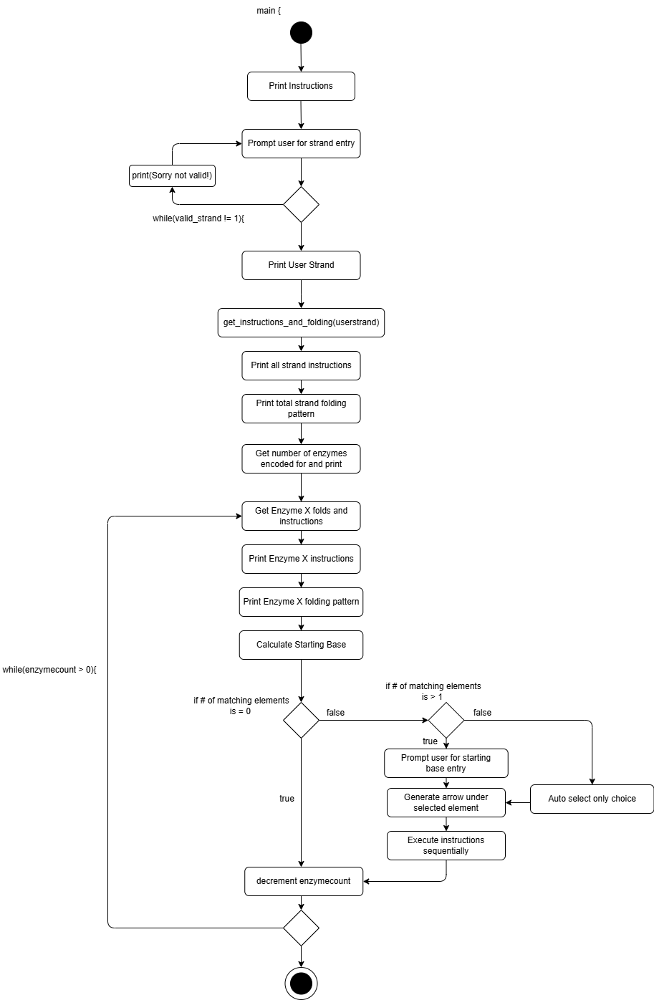

# Typogenetics

From Godel, Escher, Bach: An Eternal Golden Braid. Attempted in C

Typogenetics is a simplified model of genetics that demonstrates information storage and expansion, developed as a text manipulation game by Douglas Hofstadter in his book, *Godel Escher, Bach: An Eternal Golden Braid*. 
It involves typographical manipulation of sequences of the letters A, C, G, and T, which represent the nucleotide/bases that make up DNA ((A)denine, (C)ytosine, (G)uanine, and (T)hymine).
Typogenetics mimics an algorithmic game of life, where a simple structure and set of rules define a system that allows for the development of complex structures and behaviors. 

The program follows a basic flow: 

The user provides an arbitrarily long input string, known as a strand,  consisting only of the four bases. Each pair of bases will 'encode' for an instruction, which can modify the original input strand.
The list of instructions encoded for form a structure known as an enzyme. This enzyme will then start on a specific element of the user string, and begin executing the instructions in the order that 
they were encoded for. This continues until one of the stop conditions is met: either all instructions have been executed, or the enzyme 'falls' off one end of the strand. The program will then output 
the final modified strand or strands that were produced by the effects of the instructions performed. These strands can then be inputted back into the program to begin the cycle again. 

No true goal or end condition exists for the development of strands. Experiment to see certain patterns emerge from the different strand structures. 
One goal set out by Hofstadter in the spirit of GEB is to create a self replicating strand, that is to say,  one that reproduces itself after any number of cycles through the encoding and execution process,
alongside any other output strands. 

## Definitions

- **Base:** One of the letters A, C, G, and T
    - Pyrimidines: C and T
    - Purines: A and G
- **Complementary Base:** The pyrimidine that maps to its purine and vise versa
    - A <=> T
    - G <=> C
- **Duplet:** An adjacent pairs of bases in a single strand. There are 16 possible duplets.
- **Unit:** A single position occupied by a base.
- **Strand:** A sequence of bases
    - Ex: AAAA, ATTACCA, CATCATCAT
- **Amino Acid:** An Operation/Command out of 15 that operates on a strand. Defined/Derived from a duplet in a strand.
- **Enzyme:** A sequence of amino acids that operate on a strand, one unit/base at a time.
They are said to be "bound" to the unit they are currently operating on.
    - EX: rpu-inc-cop-mvr-mvl-swi-lpu-int
- **Binding Preference:** The base that a particular enzyme always choses to start at. An intrinsic property of the enzymes structure.

### Amino Acids / Instructions

Amino acids are derived from duplets in a sequence. Single bases do not encode for any instruction, and if a sequence has a spare base at the end with no pair i.e. the strand contains an odd number of bases, the last base does not contribute an instruction or fold.

This table shows their mapping. The left side is the first base, the top is the second base. The table also says if the amino acid causes the enzyme's tertiary structure to "fold", denotes by the subscript l, r, or s.

[Note from jacob. In regards to the l, r, s. The table has some symmetry. Maybe theres some sort of clever math thing we can do to figure out which direction it should go.]

|     |  A              |  C              |  G              |  T              |
|---  | ---             | ---             | ---             | ---             |
|**A**| pun             | cuts | dels | swir |
|**C**| mvrs | mvls | copr | offl |
|**G**| inas | incr | ingr | intl |
|**T**| rpyr | rpul | lpyl | lpul | 

| Abbreviation | Description | Implementation State |
| ---          | ---         | ---                  |
| [pun](#pun)  | Punctuates strands, allowing them to encode for multiple enzymes | DONE! |
| [cut](#cut)  | Cut Strand(s) | DONE! |
| [del](#del)  | Delete a base from strand | |
| [swi](#swi)  | Switch enzyme to other strand | |
| [mvr](#mvr)  | Move one unit to the right | |
| [mvl](#mvl)  | Move one unit to the left | |
| [cop](#cop)  | Turn on copy mode | |
| [off](#off)  | Turn off copy mode | |
| [ina](#ina)  | Insert A to the right of this unit | |
| [inc](#inc)  | Insert C to the right of this unit | |
| [ing](#ing)  | Insert G to the right of this unit | |
| [int](#int)  | Insert T to the right of this unit | |
| [rpy](#rpy)  | Search of the nearest pyrimidine to the right | |
| [rpu](#rpu)  | Search for the nearest purine to the right | |
| [lpy](#lpy)  | Search for the nearest pyrimidine to the left | |
| [lpu](#lpu)  | Search for the nearest purine to the left   | |

#### pun

Not an Amino acid/instruction, but deserves special clarification. 

Punctuates the strand, allowing one strand to encode for multiple enzymes. 
When determining the enzymes encoded for by a strand, the prescence of the pun instruction 
ends the enzyme early, and an additional enzyme is determined from the remaining strand, decoding 
until the end of the strand or another pun is reached. These enzymes will act sequentially on
the strand, one at a time. The portion of a strand that encodes for a specific enzyme is known
as a 'gene', so one strand may contain multiple (or no) genes that encode for the same number of enzymes. 
Pun has no folding direction, and therefore does not contribute to the folding pattern of the enzyme, 
as well as no additional effects on the enzyme past encoding. 
 
#### cut

Cuts the strand at the unit the enzyme is currently bound to.
The cut is placed to the right of the bound unit.
Cut applies to both the "active" strand and the "complementary" strand that
is being generated from the copy mode, regardless of if copy mode is enabled or not. 

#### del 

Deletes the base that the enzyme is attached to, and then the enzyme moves to the right. 
Only pertains to the active strand, *not* the complementary strand, regardless of if copy mode is on or not. 

#### swi

Switches the enzyme from the "active" strand to the "complementary" strand. Since the complementary strand
is represented upside-down above the active strand (see [cop](#cop)), switching strands seems to reverse the order 
of the bases in the now active strand. If a switch occurs and there are no bases in the complementary strand above 
where the enzyme is acting, the enzyme falls off and ends acting.  

#### mvr

Moves the enzyme one base to the right. If the enzyme moves off the end of the strand or into a gap with no bases, then it finishes executing
even if it had more instructions left to execute. 

#### mvl

Moves the enzyme one base to the left. If the enzyme moves off the front of the strand or into a gap with no bases, then it finishes executing
even if it had more instructions left to execute, same as in mvr. 

#### cop

Places the complement of the current base into the complementary strand, and enters "copy mode." Each base has its corresponding
complement, known as the complementary base pairing (see [Definitions](#Definitions)). Copy mode remains in effect until an [off](#off) 
instruction is reached (or the end of the strand/enzyme). While in copy mode, any base that is "touched" by the enzyme will 
have its complementary base placed above it in the complementary strand. When bases are copied into the complementary 
strand, they are placed *upside-down* above the element copied, so that the strands are mirrored to each other. Copy mode applies 
*after* a move, so that the movement off of a strand or into a gap between bases still preserves the behavior of the strand ending normally.  
While in copy mode, additional cop instructions do nothing. 

#### off

Turns off copy mode. If copy mode is not enabled, then this does nothing. 

#### ina

Inserts an 'A' base into the position to the right of the enzyme, and if copy mode is on, then the base's complement (T) is placed above into
the complementary strand. 

#### inc

Inserts an 'C' base into the position to the right of the enzyme, and if copy mode is on, then the base's complement (G) is placed above into
the complementary strand. 

#### int

Inserts an 'T' base into the position to the right of the enzyme, and if copy mode is on, then the base's complement (A) is placed above into
the complementary strand. 

#### ing

Inserts an 'G' base into the position to the right of the enzyme, and if copy mode is on, then the base's complement (C) is placed above into
the complementary strand. 

#### rpy

Moves to the nearest pyrine (See [Definitions](#Definitions)) to the right of the currently bound unit.
If there are no pyrines to the right of the current base, it will attempt to find one but fall off the
strand when it finds a blank unit, such as at the end of a strand. With copy mode enabled, each base
touched while sliding to the next pyrine will be copied into the complementary strand.

#### rpu

Moves to the nearest purine (See [Definitions](#Definitions)) to the right of the currently bound unit.
If there are no purines to the right of the current base, it will attempt to find one but fall off the
strand when it finds a blank unit, such as at the end of a strand. With copy mode enabled, each base
touched while sliding to the next purine will be copied into the complementary strand. 

#### lpy

Moves to the nearest pyrine (See [Definitions](#Definitions)) to the left of the currently bound unit.
If there are no pyrines to the left of the current base, it will attempt to find one but fall off the
strand when it finds a blank unit, such as at the end of a strand. With copy mode enabled, each base
touched while sliding to the next pyrine will be copied into the complementary strand.

#### lpu

Moves to the nearest purine (See [Definitions](#Definitions)) to the left of of the currently bound unit.
If there are no purines to the left of the current base, it will attempt to find one but fall off the
strand when it finds a blank unit, such as at the end of a strand. With copy mode enabled, each base
touched while sliding to the next purine will be copied into the complementary strand.

## Binding Preference

Binding preference is determined by the relative orientation of the first and last segments of an enzymes's tertiary structure.

| First Segment | Last Segment | Binding-Letter/Base |
| ---           | ---          | ---                 |
| &rarr; | &rarr; | A |
| &rarr; | &uarr; | C |
| &rarr; | &darr; | G |
| &rarr; | &larr; | T |

### Authors' Note: 
A number of ambiguities present in the original program are given defined behavior in this rendition of the system, listed below. 

**Binding Preference of Single Amino Acid Enzymes**

Since the binding preference of an enzyme is determined by the relative orientation of its first and last amino acids, enzymes which consist of only a single amino acid don't have a clearly defined 
rule for determining their starting base binding preference. We have elected to follow the fairly intuitive convention of having this class of enzymes start on 'A', counting their only element
as both the first and last fold. With both directions facing right, it follows that the enzyme would bind to base 'A' to begin with. 

**Starting Base Position Preference of Enzymes**

Hofstadter also fails to define which element the enzyme prefers to bind to when given a selection of options. Examples in the book show the first matching element most commonly selected, but 
this is not an explicitly defined rule. As such, the user is given a selection of bases to choose from when there are multiple matching bases in the strand. The user may also pass 2 parameters to
the program, --Select-random (-s) and --first-matching (-f) which will have enzymes either randomly choose a starting base to begin on each time, or the first matching element of their starting base 
preference. 

**Strands with Multiple Genes**

With no demonstrations of punctuated strands, it is unclear if enzymes produced from a gene act only on the gene they were encoded by, or on the whole strand containing the genes. Since AA/pun 'punctuates'
a strand and does not separate it into multiple strands, it seems intuitive that an enzyme would bind to any preferred element along the entire strand, not just elements in that enzyme's gene. The next enzyme or 
enzymes would act on the strand following the modifications performed by the previous enzyme, maintaining their binding preference determined from their specific encoding. Once all enzymes that were encoded for by 
the original strand have acted, then the strand is outputted. 

**Behavior of lpy, lpu, rpy, and rpu**

 
<figure class="image">

</figure>

Preliminary Program Flowchart

